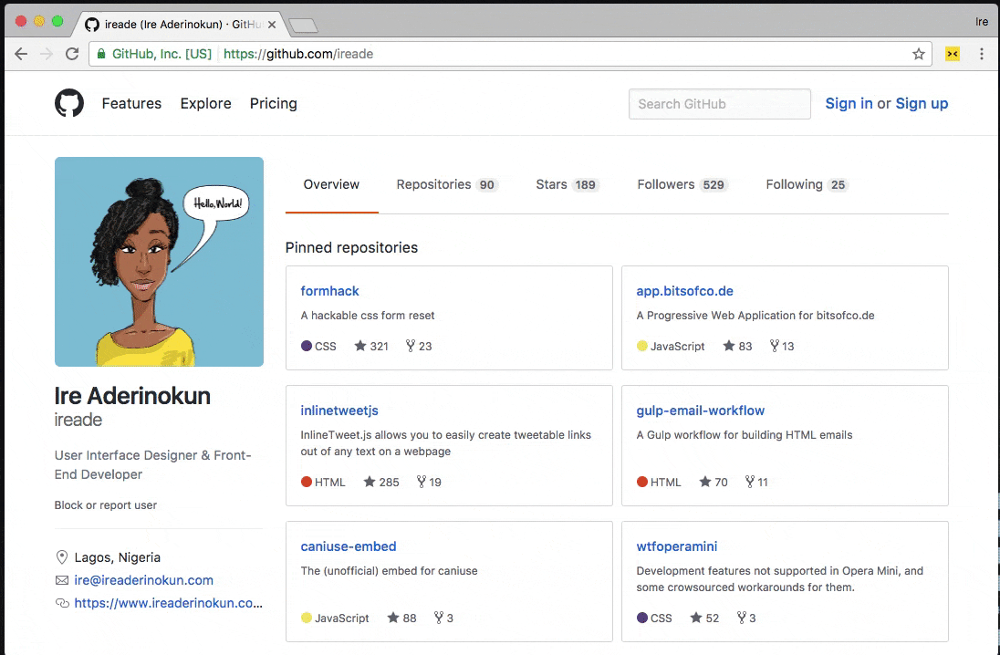
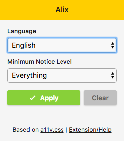

# Alix

Alix is a browser extension for a11y.css. It allows you to lint your HTML for Accessibility issues simply by applying a stylesheet that makes use of advanced CSS selectors.

Based on [a11y.css](http://ffoodd.github.io/a11y.css/), created by Gaël Poupard.

**[Install Alix for Chrome](https://chrome.google.com/webstore/detail/alix-for-chrome/aepmadgjacfjcneccddiccnkbpimobge)**

## Demo

### Options

- **Language**: The language you want the messages to be displayed in. Choose either between English or French

- **Minimum Notice Level**: The minimum level of errors you want to be shown. Choose between the following four options:
	- **Only Errors**
	- **Warnings and Erros**
	- **Obsolete Stuff, Warnings, and Errors**
	- **Everything**

## Credits and Licence

- a11y.css was credted by Gaël Poupard is distributed under the [MIT licence](http://opensource.org/licenses/MIT) and [CC BY 3.0 FR](http://creativecommons.org/licenses/by/3.0/fr/)
- This extension was created by Ire Aderinokun and is distributed under the [MIT licence](http://opensource.org/licenses/MIT)